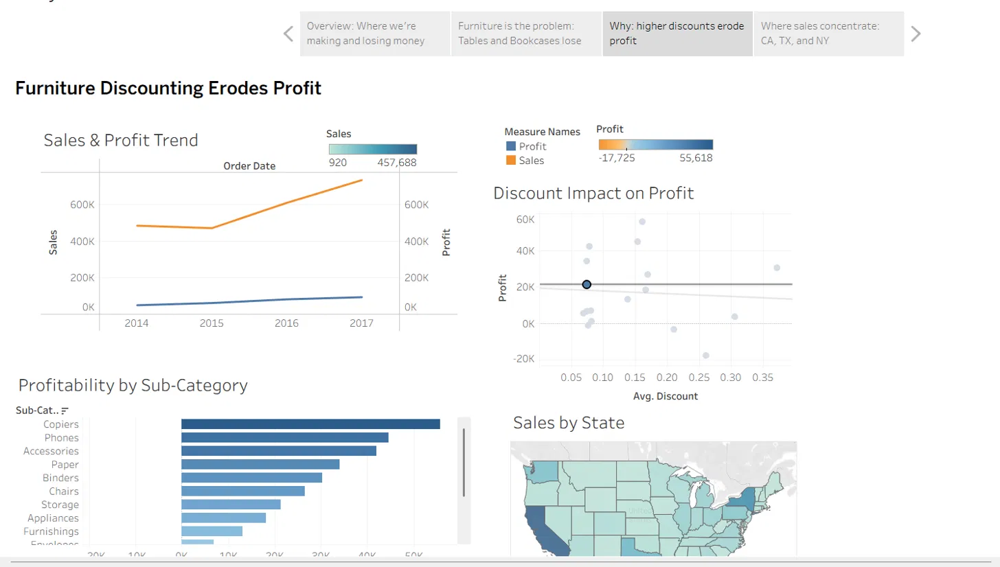
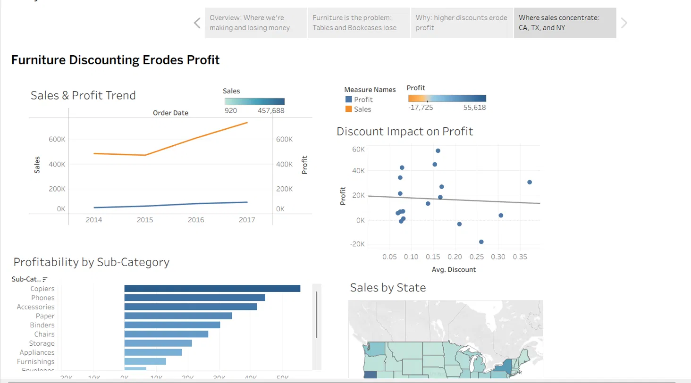

# superstore-data-visualization
# Furniture Discounting Erodes Profit
### Superstore Sales Data Visualization & Storytelling — Task 2

## Overview: Where we're making and losing money

## Furniture is the problem: Tables and Bookcases lose money

Tables lose $17,725 — likely due to high shipping costs relative to price.

## Why: higher discounts erode profit

## Where sales concentrate: CA, TX, and NY

