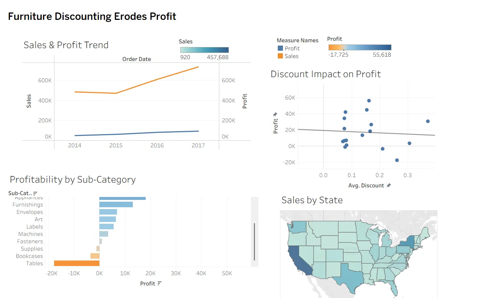

# 📊 Furniture Discounting Erodes Profit
### Data Visualization & Storytelling — Superstore Sales Analysis

---

## 📌 Objective
Create visualizations that convey a compelling business story using Superstore sales data — identifying where the business is winning, where it is losing money, and why.

---

## 🛠️ Tools Used
- **Tableau Public** — for building interactive charts, dashboard, and storyboard
- **Dataset** — Sample Superstore (9,994 orders, 2014–2017)

---

## 📖 Story: Where We Win and Lose

### 1️⃣ Overview: Sales and Profit Are Growing — But Not Equally

Sales grew from ~$480K in 2014 to over $700K in 2017. Profit grew too, but
